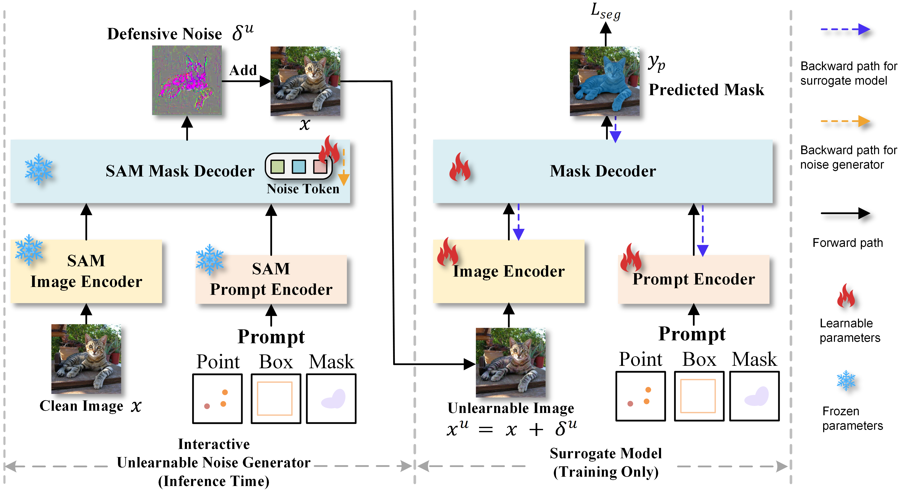

# UnSeg: One Universal Unlearnable Example Generator is Enough against All Image Segmentation [NeurIPS 2024]

## :rocket: Updates
* **[2024/12/11]** We were informed that the approval process for open-sourcing our code is lengthy. **🔥 If you need our code for experiments, please feel free to contact: yesun23@m.fudan.edu.cn**.

* **[2024/12/3]** Code will be available. Thanks for your attention and patience.

* **[2024/10/13]** Our paper is available in [[Arxiv](https://arxiv.org/abs/2410.09909)].
  
## Abstract

Image segmentation is a crucial vision task that groups pixels within an image into semantically meaningful segments, which is pivotal in obtaining a fine-grained understanding of real-world scenes. However, an increasing privacy concern exists regarding training large-scale image segmentation models on unauthorized private data. In this work, we exploit the concept of unlearnable examples to make images unusable to model training by generating and adding unlearnable noise into the original images. Particularly, we propose a novel Unlearnable Segmentation (UnSeg) framework to train a universal unlearnable noise generator that is capable of transforming any downstream images into their unlearnable version. The unlearnable noise generator is finetuned from the Segment Anything Model (SAM) via bilevel optimization on an interactive segmentation dataset towards minimizing the training error of a surrogate model that shares the same architecture with SAM but is trained from scratch. We empirically verify the effectiveness of UnSeg across 6 mainstream image segmentation tasks, 10 widely used datasets, and 7 different network architectures, and show that the unlearnable images can reduce the segmentation performance by a large margin. Our work provides useful insights into how to leverage foundation models in a data-efficient and computationally affordable manner to protect images against image segmentation models. 
<p align="center">
  
</p>


## 1. Installation
Clone this repository and navigate to project folder

```bash
git clone https://github.com/sunye23/Temporary_Project.git
cd Temporary_Project
```

Quick Installation **(Ensure your CUDA version is correct before installation; we use torch==1.13.1+cu117.)**

```Shell
conda create --name unseg python=3.8 -y
conda activate unseg
bash install.sh
git clone https://github.com/facebookresearch/detectron2.git
cd detectron2
pip install -e .
pip install git+https://github.com/cocodataset/panopticapi.git
pip install git+https://github.com/mcordts/cityscapesScripts.git
```

We organize the training folder as follows.
```
Project
|____data
| |____cascade_psp
| |____DIS5K
| |____thin_object_detection
|____eval
|____scripts
|____generate
|____weight_dir
| |____Generator_unseg_final.pth
|____pretrained_checkpoint
| |____modified_mae_pretrain_vit_base.pth
| |____sam_vit_b_backbone.pth
| |____sam_vit_b_maskdecoder.pth
| |____sam_vit_b_prompt_decoder.pth
|____train.py
|____utils
|____segment_anything_training
|____work_dirs
```
## 2. Training Data Preparation

Our training data is based on HQSeg-44K and can be downloaded from [hugging face link](https://huggingface.co/sam-hq-team/sam-hq-training/tree/main/data)

## Expected dataset structure for HQSeg-44K

```
data
|____DIS5K
|____cascade_psp
| |____DUTS-TE
| |____DUTS-TR
| |____ecssd
| |____fss_all
| |____MSRA_10K
|____thin_object_detection
| |____COIFT
| |____HRSOD
| |____ThinObject5K
```

## 3. Pretrained checkpoint Preparation

Download the [model weight](https://pan.baidu.com/s/1cGmfyNAlbE3Z0NFjsCr92w?pwd=7dur ) here and put them into right dir.

## 4. Training
Model training is based on RTX3090 x 8.

```Shell
bash scripts/run_train.sh
```

## 5. UEs Generation
UEs generation is based on RTX3090 x 8.

Before generating ues, place the clean images and the corresponding groundtruths in the correct directory. For the datasets such as coco, cityscapes, and ade20k, please refer to [Mask2former](https://github.com/facebookresearch/Mask2Former) for data preparation. 

Here we only provide the download guidance for the pascal voc dataset.

<details>
<summary>
PASCAL VOC 2012
</summary>

- Download [the PASCAL VOC 2012 development kit](http://host.robots.ox.ac.uk/pascal/VOC/voc2012).
  ``` bash
  wget http://host.robots.ox.ac.uk/pascal/VOC/voc2012/VOCtrainval_11-May-2012.tar
  tar –xvf VOCtrainval_11-May-2012.tar
  ```
- Download augmented annoations `SegmentationClassAug.zip` from [SBD dataset](https://ieeexplore.ieee.org/stamp/stamp.jsp?arnumber=6126343&casa_token=cOQGLW2KWqUAAAAA:Z-QHpQPf8Pnb07A75yBm2muYjqJwYUYPFbwwxMFHRcjRX0zl45kEGNqyTEPH7irB2QbabZbn&tag=1) via this [link](https://www.dropbox.com/s/oeu149j8qtbs1x0/SegmentationClassAug.zip?dl=0).
- Make your data directory like this below
  ``` bash
  VOCdevkit/
  └── VOC2012
      ├── Annotations
      ├── ImageSets
      ├── JPEGImages
      ├── SegmentationClass
      ├── SegmentationClassAug
      └── SegmentationObject
    ```

  </details>
  
For Pascal VOC dataset. 
```Shell
bash scripts/generate_pascal.sh
```

For Ade20K dataset. 
```Shell
bash scripts/generate_ade20k.sh
```

For COCO dataset. 
```Shell
bash scripts/generate_coco.sh
```

For Cityscapes dataset. 
```Shell
bash scripts/generate_cityscapes.sh
```

For interactive dataset. 
```Shell
bash scripts/generate_interactive.sh
```

For remote sensing dataset, please refer to [Rsprompter](https://github.com/KyanChen/RSPrompter) for data preparation. 
```Shell
bash scripts/generate_remote.sh
```

For medical image dataset.
```Shell
bash scripts/generate_medical.sh
```
## 6. Evaluation

For the DeepLabv1 evaluation, we mainly employ the code provided by [MCTFormer](https://github.com/xulianuwa/MCTformer). You should follow the work to prepare the weights and environments. We also provide the code and the script under the eval dir. You could use the command below:
```Shell
bash eval/run_seg.sh
```

For mainstream image segmentation evaluation, please refer to [Mask2former](https://github.com/facebookresearch/Mask2Former).

For interactive image segmentation evaluation, please refer to [SAM-HQ](https://github.com/SysCV/sam-hq).

For remote sensing evaluation, please refer to [Rsprompter](https://github.com/KyanChen/RSPrompter).

For medical image segmentation evaluation, our code is based on the **segmentation_models_pytorch** codebase.

For object detection evaluation, please refer to [DINO](https://github.com/IDEA-Research/DINO).

## Citation
**If you find UnSeg useful for your research and applications, please kindly cite using this BibTeX:**
```bibtex
@inproceedings{sun2024unseg,
  title={UnSeg: One Universal Unlearnable Example Generator is Enough against All Image Segmentation},
  author={Sun, Ye and Zhang, Hao and Zhang, Tiehua and Ma, Xingjun and Jiang, Yu-Gang},
  booktitle={NeurIPS},
  year={2024}
}
```
